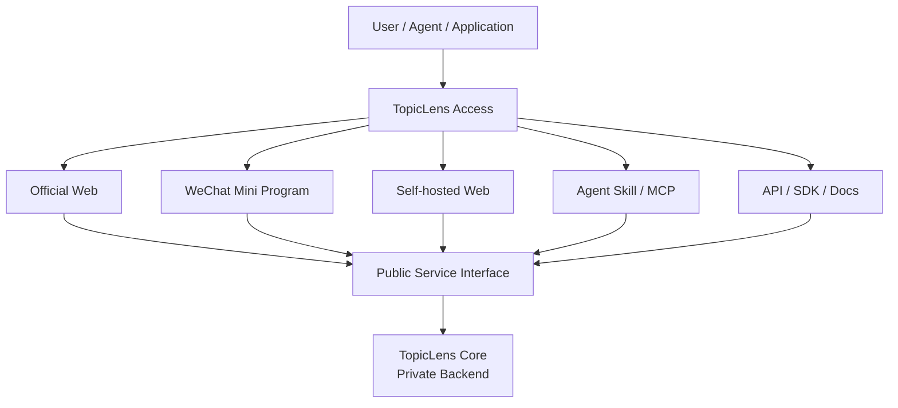

# TopicLens Access

> TopicLens 的公开访问、集成与使用入口

`TopicLens-Access` 是 **TopicLens · 主题透视** 的公开 Access Layer。

TopicLens 核心系统负责领域知识、研究执行与长期知识积累；本仓库不包含核心后端实现，而是用于公开用户和 Agent 可以如何访问、集成和使用 TopicLens。

## 项目定位

TopicLens 是一套面向专业领域、以 Topic 为中心、由长期领域知识支撑的 Deep Research 系统。

本仓库主要回答一个问题：

> **用户、Agent 和其他软件如何使用 TopicLens？**

它与 TopicLens 私有核心系统之间通过稳定、受控的服务接口连接。



## 计划公开的访问路径

### 官方 Web

TopicLens 官方提供的浏览器访问入口。

用于直接发起研究、查看研究状态与结果，并逐步承载 Topic、历史研究和其他面向最终用户的功能。

### 微信小程序

面向微信生态的轻量访问入口。

用于移动端快速提问、查看研究结果、接收任务状态等。具体能力以后端公开接口为准。

### 自托管 Web

提供可自行部署的 Web 客户端或参考实现。

自托管仅意味着用户可以部署自己的访问界面，并不意味着 TopicLens 核心后端代码开放。客户端通过公开服务接口访问 TopicLens。

### Agent Skill / MCP

为 Codex、Claude Code、WorkBuddy、OpenClaw 及其他支持 Skill / MCP / Tool Calling 的 Agent 提供机器访问方式。

对 Agent 暴露的能力将采用明确的 TopicLens 命名空间，例如：

```text
topiclens-research
topiclens.search
topiclens.research
topiclens.status
```

具体 Tool / Skill Contract 将随公开接口逐步稳定。

### API / SDK

后续可根据实际使用需求提供稳定 API、参考客户端和 SDK。

公开内容包括接口定义、认证方式、请求与响应格式、示例代码和错误处理说明；不公开服务端内部 Router / Graph / Field 的实现细节。

## 与 TopicLens Core 的边界

`TopicLens-Access` 与 TopicLens 核心仓库严格分离。

公开仓库可以包含：

- Web / 小程序等访问端代码；
- Agent Skill、MCP Server 或适配器；
- API / SDK 客户端；
- 配置模板；
- 示例程序；
- 部署脚本；
- 用户文档、集成文档与使用说明；
- 公开接口 Schema 与兼容性说明。

本仓库不包含：

- TopicLens Core 后端源码；
- Router 的核心研究决策逻辑；
- Graph 的研究执行与编排实现；
- Field 的私有数据、知识库、Catalog、Evidence Store；
- 内部 Prompt、私有 Provider 配置与商业策略；
- 生产环境凭据、密钥与内部基础设施配置。

## 设计原则

1. **Open Access, Private Core** — 访问方式和集成能力可以开放，核心研究系统保持私有。
2. **Stable Contract** — Access 层只依赖稳定、版本化的公开接口，不依赖后端内部实现。
3. **Multiple Entrances, One Service** — Web、小程序、Skill、MCP、API 等只是不同入口，共享同一 TopicLens 服务能力。
4. **Replaceable Clients** — 任一客户端都应可以独立升级或替换，而不影响核心研究系统。
5. **No Backend Leakage** — 不通过公开仓库泄露内部数据结构、私有知识资产或后端实现细节。

## 计划中的仓库结构

```text
TopicLens-Access/
├── README.md
├── docs/
│   ├── getting-started.md
│   ├── official-web.md
│   ├── wechat-mini-program.md
│   ├── self-hosted-web.md
│   ├── agent-skill.md
│   ├── mcp.md
│   └── api.md
├── web/
├── miniapp/
├── skills/
├── mcp/
├── sdk/
└── examples/
```

以上目录仅作为当前规划，实际代码结构将随着首批公开入口落地后调整。

## 当前状态

项目处于 Access Layer 重新定义阶段。

近期优先事项：

1. 明确第一版公开服务接口；
2. 确定官方 Web 的最小访问流程；
3. 定义 `topiclens-research` Agent Skill；
4. 建立自托管 Web 的最小参考实现；
5. 整理统一的 Getting Started 与认证说明；
6. 在公开前完成安全边界和敏感信息检查。

## License

本仓库采用 [MIT License](LICENSE)。

MIT 仅适用于 `TopicLens-Access` 仓库中公开的访问层代码、客户端、Skill、MCP、SDK、示例与文档。TopicLens Core 为独立的私有商业系统，不因本仓库采用 MIT 而开放或授权其后端实现、数据和知识资产。

---

**TopicLens Access** 负责让 TopicLens 被使用；**TopicLens Core** 负责真正完成研究并积累知识。
